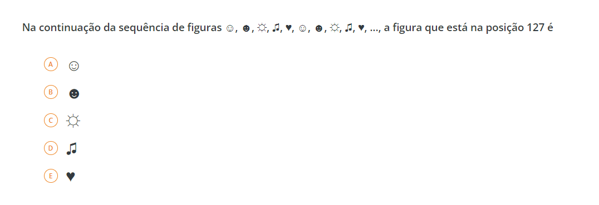
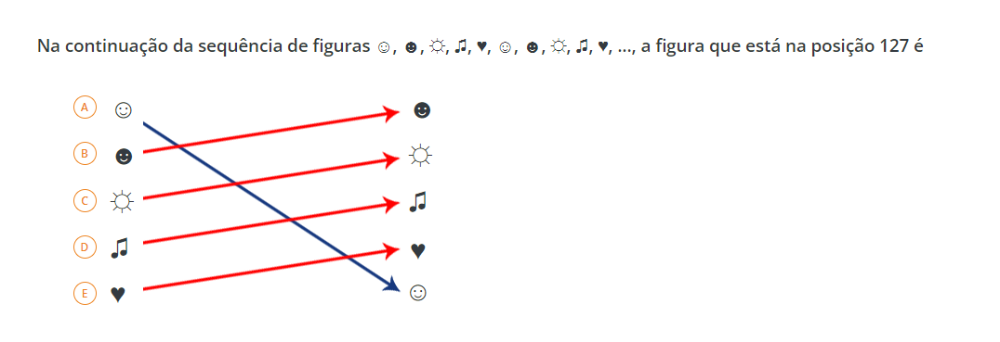

# Problem 02

#### Description: This is a problem of the elements sequence. To solve this, I used hte logic of calculate mod of position requested in the question. Your can follow up resolve in code developed in python language via folder: [Code - click here](../Problem02/Code/main.py).

<br />
Representation of the problem that I will explanish below:



````
See: The elements in alternatives 'a' unitl 'e' are symbols. In order to facilitate the calcule, will be reordered.
````
<br>



But, in the response, it is used the original order. folow below!

````

Begin position in number 0 until 4. To reorder elements, put the first element in last position (4) in the outher array. The remaining itemns in the sequence, begin of position 0 until position 3.

The explanish to reorder the elements is because the calcule of the mod of division can return a result 0, so the 0 represents the last item of array.

Reorder:
    Position 0: A: Dark face smile
    Position 1: B: Sun
    Position 2: C: Music
    Position 2: D: Heart
    Position 4: E: Light face smile

** Attention: This is only representation of the array. In definitive result use the original order. **


Position requered: 127
Total of itemns: 5

Module of the division: 127 % 5 = 2

Response: Position 2 in original order is alternative B (dark face smile).

````